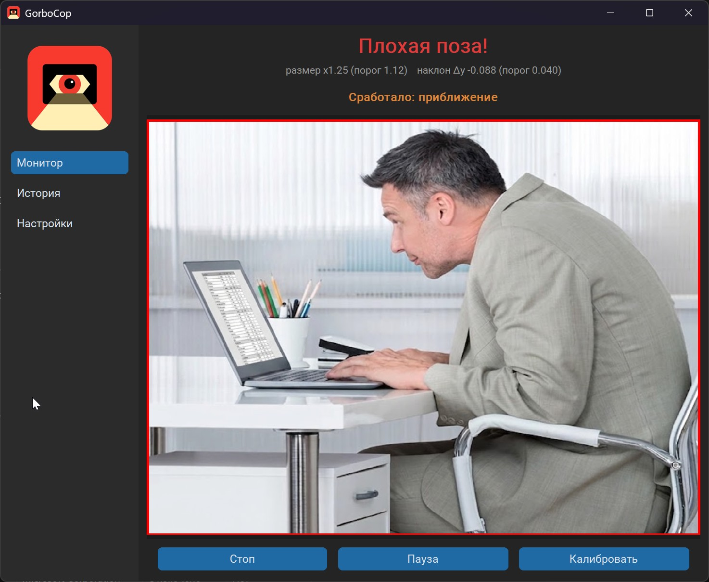

# GorboCop

Следит за осанкой через вебкамеру и предупреждает, когда вы наклоняетесь к
клавиатуре. Лицо приблизилось к камере или опустилось вниз дольше заданного
времени — звук и всплывающее уведомление Windows.



## Возможности

- Детекция позы по вебкамере на MediaPipe Face Detection: отслеживается размер
  лица (приближение) и его вертикальное положение (наклон).
- Калибровка под себя: сидите ровно несколько секунд — это становится эталоном.
  До калибровки тревоги не срабатывают, показывается подсказка.
- Индикация причины срабатывания: наклон вниз и/или приближение.
- Тревога звуком и Windows-тостом (с иконкой) и настраиваемым текстом;
  пауза между тревогами, чтобы не долбить.
- Усиление громкости сигнала поверх уровня файла (с защитой от клиппинга).
- История срабатываний с дашбордом (сводка, график по дням, последние события)
  и настраиваемым сроком хранения; старое автоудаляется.
- Тёмный интерфейс на customtkinter с тремя экранами: Монитор, История,
  Настройки.
- Живая настройка порогов: на экране «Настройки» — превью, индикатор
  «Поза в норме / Сработало бы» в реальном времени и метрики; на этом экране
  звук и тосты заглушены, чтобы спокойно подбирать чувствительность.
- Пропуск мониторинга, пока активен скринсейвер, спит монитор или заблокирована
  сессия (Windows API), а также когда за компьютером никого нет (нет ввода с
  клавиатуры и мыши дольше заданного времени).
- Защита от ложных тревог в пустой комнате: лимит тревог подряд (после него —
  тишина до возвращения нормальной позы) и игнорирование неподвижных объектов —
  подголовник кресла, принятый за лицо, тревогу не вызовет.
- Настраиваемый порог уверенности детектора лица (выше = меньше ложных
  срабатываний), применяется на лету.
- Автопереподключение камеры, если она отвалилась или была занята другим
  приложением.
- Сворачивается в трей; клик по иконке — пауза/возобновление, в меню — показать
  окно и выход.
- Единственный экземпляр: повторный запуск не плодит копии, а разворачивает уже
  открытое окно.
- Автозапуск с Windows и старт свёрнутым в трей (опционально).
- Сброс настроек к значениям по умолчанию одной кнопкой.
- Все параметры хранятся в `config.json`, история — в `history.json`.

## Требования

- Windows 10/11 (64-bit)
- Python 3.12 (MediaPipe пока не поддерживает 3.13+) — только для запуска из
  исходников и сборки
- Вебкамера

## Установка

Установщика нет — это портативная версия. Один файл `GorboCop.exe`, который
работает без установки: положите куда угодно и запускайте. Получить его можно
двумя способами:

- скачать готовый `GorboCop.exe` из раздела Releases;
- собрать самостоятельно (см. «Сборка в один EXE»).

`config.json` и `history.json` создаются в той же папке, где лежит `GorboCop.exe`,
— ничего в систему не прописывается (кроме опционального ключа автозапуска).
Чтобы перенести настройки и историю на другой компьютер, скопируйте папку
целиком.

## Запуск из исходников

```powershell
py -3.12 -m venv .venv
.venv\Scripts\python.exe -m pip install -r requirements.txt
.venv\Scripts\python.exe main.py
```

## Использование

1. При запуске включается камера и живое превью; статус — «Нужна калибровка».
2. Нажмите «Калибровать» и посидите ровно — снимется эталон позы.
3. При наклоне к клавиатуре дольше заданной задержки сработает сигнал.
4. Чувствительность удобно подбирать на экране «Настройки»: двигайте ползунки и
   следите за живым индикатором (тревоги там не срабатывают).

## Конфигурация

`config.json` создаётся рядом с приложением при первом запуске. Все параметры
доступны также через экран «Настройки».

| Параметр | Назначение |
|---|---|
| `camera_index` | индекс вебкамеры |
| `calibration_seconds` | длительность калибровки |
| `size_threshold` | порог увеличения лица (приближение) |
| `y_drop_threshold` | порог опускания лица вниз (наклон) |
| `alert_after_seconds` | сколько держится плохая поза до тревоги |
| `cooldown_seconds` | пауза между тревогами |
| `min_detection_confidence` | порог уверенности детектора лица (выше = строже) |
| `idle_skip_minutes` | пропуск мониторинга без ввода дольше N минут (0 = выкл) |
| `max_consecutive_alerts` | лимит тревог подряд (0 = без лимита) |
| `static_scene_minutes` | неподвижный объект дольше N минут — не лицо (0 = выкл) |
| `sound_path` | путь к звуку тревоги (по умолчанию `alert.mp3`) |
| `sound_gain` | множитель громкости (1.0 = как в файле) |
| `sound_enabled`, `toast_enabled` | включение звука и тостов |
| `alert_title`, `alert_text` | заголовок и текст уведомления |
| `history_retention_days` | срок хранения истории |
| `start_minimized`, `autostart` | поведение запуска |

## Сборка в один EXE

```powershell
.venv\Scripts\python.exe -m pip install pyinstaller
.venv\Scripts\python.exe -m PyInstaller GorboCop.spec --noconfirm --clean
```

Результат — `dist\GorboCop.exe` (~137 МБ), самодостаточный: Python и библиотеки
на целевой машине не нужны. Spec-файл упаковывает модели MediaPipe, данные
customtkinter и ресурсы (иконки, звук), а тяжёлые неиспользуемые зависимости
(`jax`, `jaxlib`, `scipy`, `tensorflow`) исключены для уменьшения размера.

Первый запуск one-file EXE занимает несколько секунд — распаковка во временную
папку.

## Структура проекта

```
app/
  config.py           параметры, пути к данным/ресурсам, config.json
  detector.py         MediaPipe Face Detection, калибровка, детекция позы
  power_monitor.py    пропуск при сне монитора / скринсейвере / блокировке
  notifier.py         звук (pygame) и Windows-тост
  history.py          история срабатываний и агрегаты для дашборда
  autostart.py        автозапуск через реестр HKCU
  single_instance.py  контроль единственного экземпляра
  tray_icon.py        иконка в трее
  ui.py               главное окно, сайдбар, оркестрация камеры/детектора
  views/
    monitor_view.py   экран мониторинга
    history_view.py   экран истории и дашборд
    settings_view.py  экран настроек с живой настройкой порогов
main.py               точка входа
GorboCop.spec         конфигурация сборки PyInstaller
```

## Лицензия

MIT — см. файл `LICENSE`.
